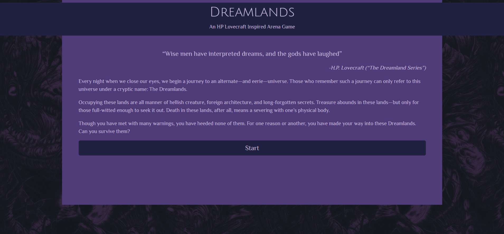
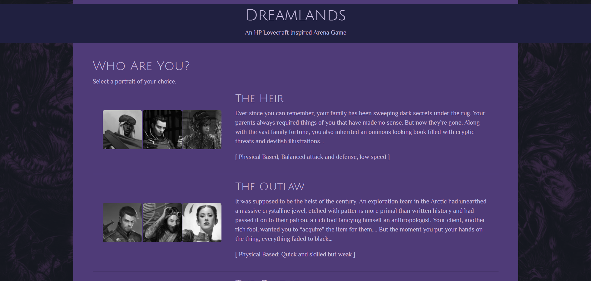
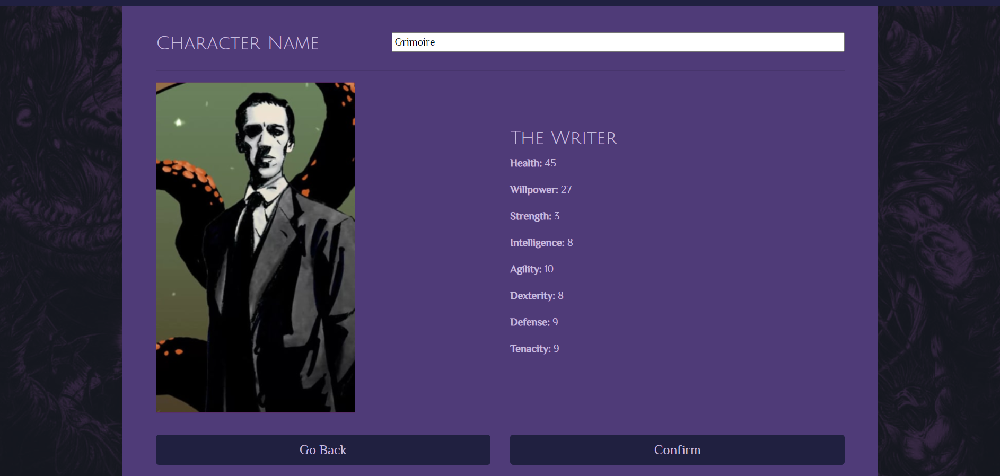
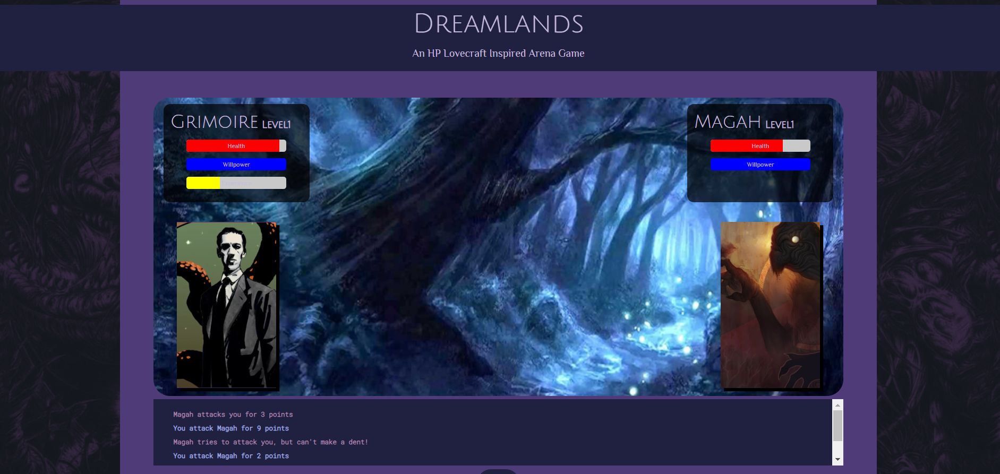

# Dreamlands - A Lovecraftian Arena game

**Link to Live:** https://themarkfullton.github.io/OOP-Arena/

Went overboard in creating a student example for OOP with JS.

Still use it in explaining classes to JS so I don't have to do the usual "dogs" example.

**Currently refactoring to meet more up-to-date JS OOP standards**

Needs added:

- Ability system
- Inventory system
- Bosses
- Story
- Original images

## Languages Used

HTML, CSS, JQuery, Javascript

## Screenshots

